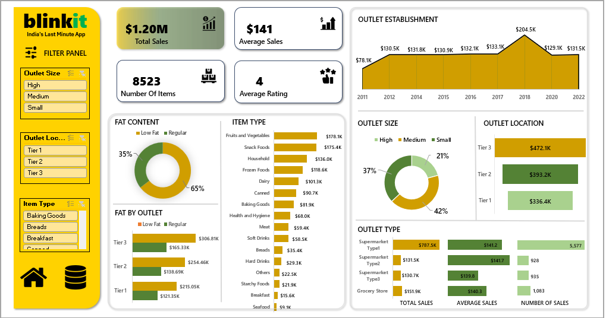

# 🛒 Blinkit Grocery Sales Dashboard (Excel BI Project)

This project presents an interactive dashboard for analyzing sales and operational metrics of Blinkit (an Indian instant delivery app). Built entirely using **Microsoft Excel**, the dashboard enables dynamic filtering and visualization of grocery sales data across outlets, item categories, outlet types, fat content, and more.

---

## 📌 Objective

To extract, clean, analyze, and visualize Blinkit grocery sales data to gain actionable insights for business decision-making using Excel’s data tools and visualizations.

---

## 📊 Dashboard Preview

### 🔹 Excel Dashboard

> 📷 **Add Screenshot**  
> Replace the image path below with your actual screenshot:
>  
> 

---

## 🧩 Key Features & KPIs

- **Total Sales & Average Sales** calculation
- **Outlet-level breakdown** (size, location, type)
- **Fat Content** and **Item Type** category comparisons
- **Outlet Establishment Trend** over the years (2011–2022)
- **Interactive slicers** for filters (Outlet Size, Item Type, Location)
- Dynamic visuals and bar charts for deep insights

---

## ⚙️ Tools & Technologies Used

- **Microsoft Excel**
  - Pivot Tables
  - Power Query
  - Formulas (SUMIFS, AVERAGEIFS, IF, LOOKUP, etc.)
  - Data Validation + Slicers
  - Charts & KPI Metrics

---

## 📈 Insights Discovered

- **Tier 3 outlets** had the highest total sales (~$472K)
- **High-fat items** contributed 65% of total sales
- **Outlet Type 1 (Supermarket)** generated the most revenue (~$787.5K)
- **Fruits & Vegetables** were the top-selling item category
- Outlet establishments peaked in **2018**, showing rapid business growth

---

## 🗂️ Dataset

- File: `BlinkIT Grocery Data Excel.xlsx`
- Contains sales data per item across various outlets, categories, locations, and fat content.

